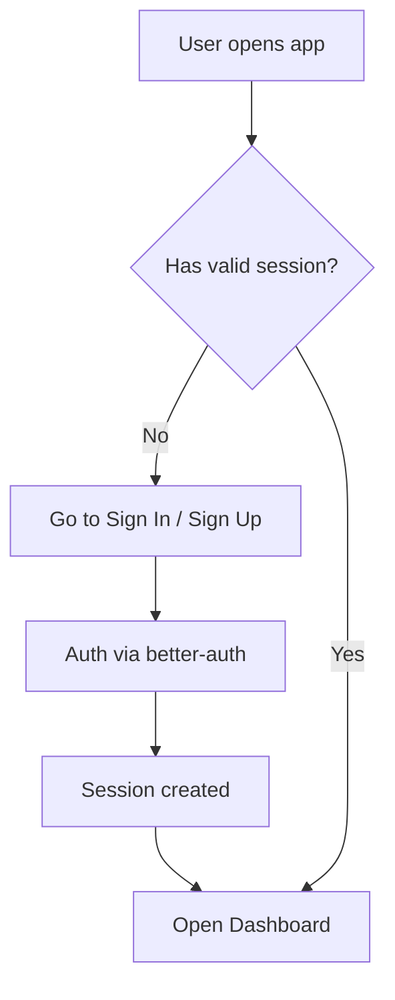
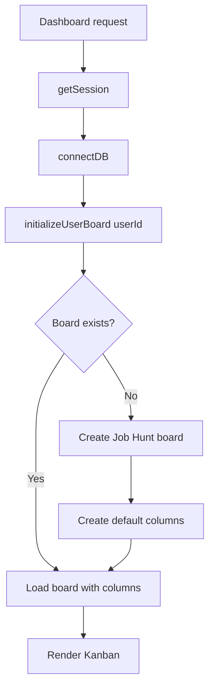
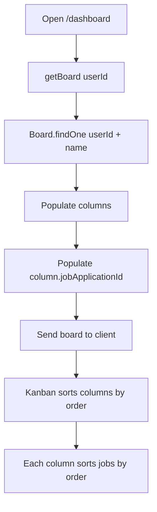
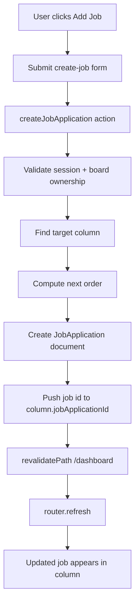
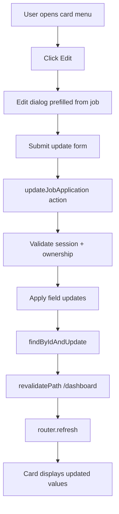
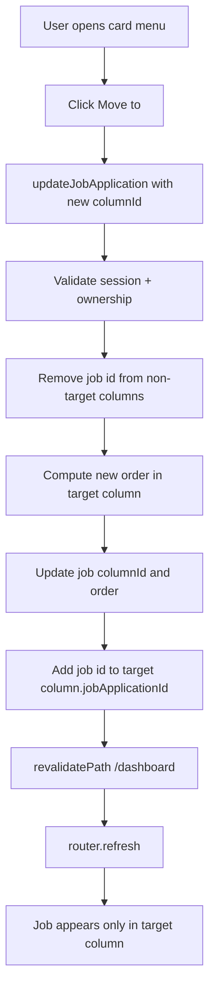
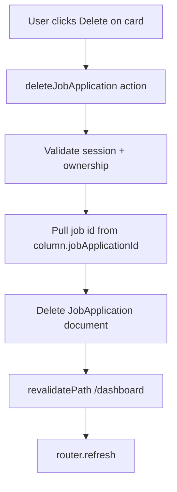
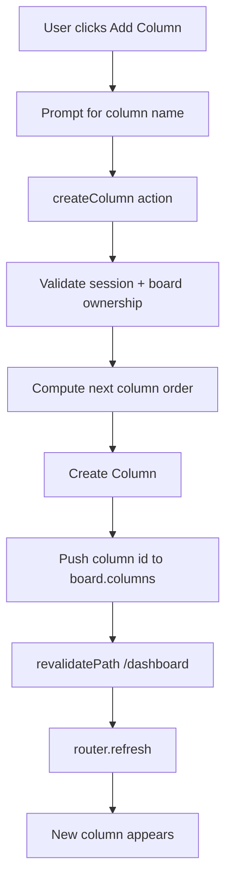
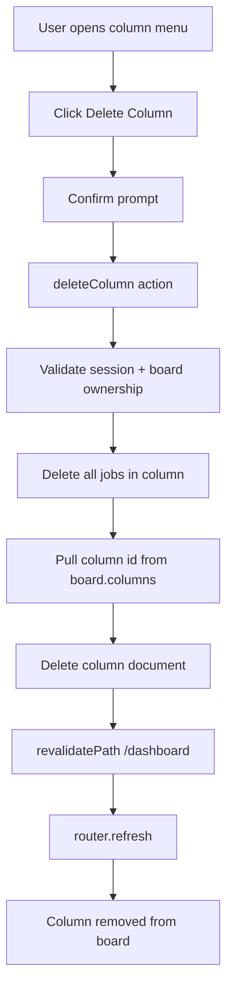
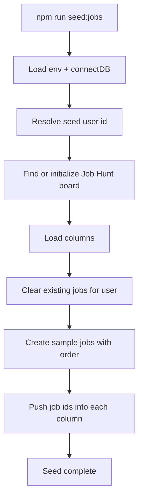

# Project Flows

This document maps the main end-to-end flows in the Job Application Tracker.

## 1) Authentication Flow

## 2) New User Board Initialization Flow

## 3) Dashboard Data Load Flow

## 4) Create Job Flow

## 5) Edit Job Flow

## 6) Move Job Between Columns Flow

## 7) Delete Job Flow

## 8) Add Column Flow

## 9) Delete Column Flow

## 10) Seed Data Flow

## Notes

- Job-to-column relationship is maintained in both places:
  - JobApplication.columnId
  - Column.jobApplicationId[]
- UI rendering uses populated Column.jobApplicationId entries.
- Order is numeric and used for deterministic sorting in columns.
